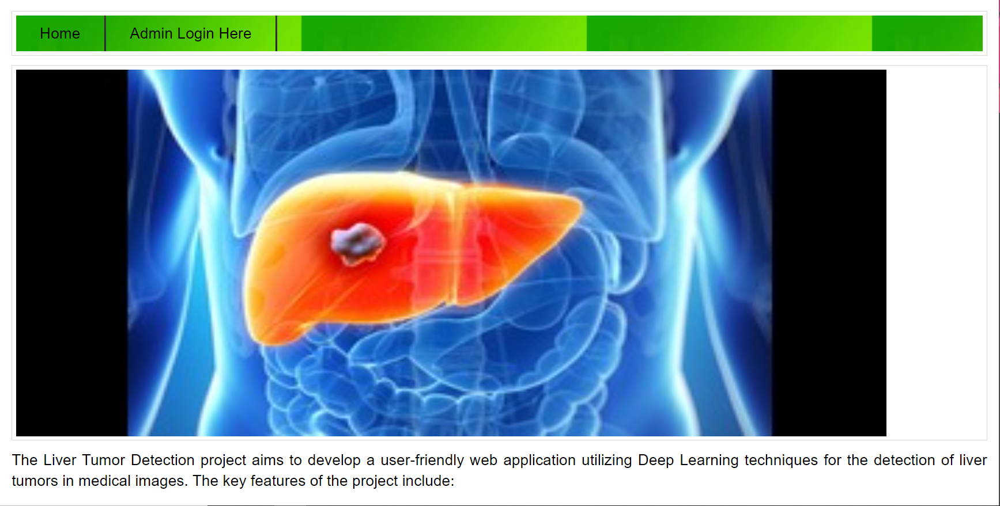
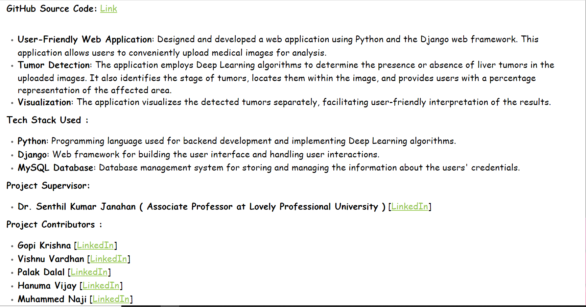
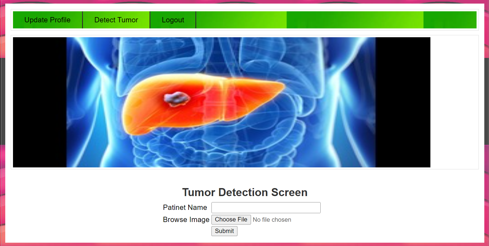
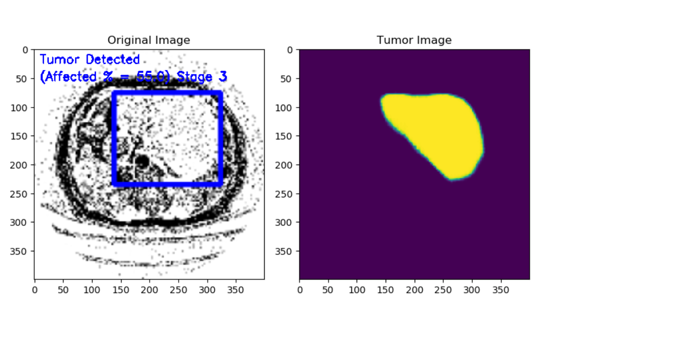
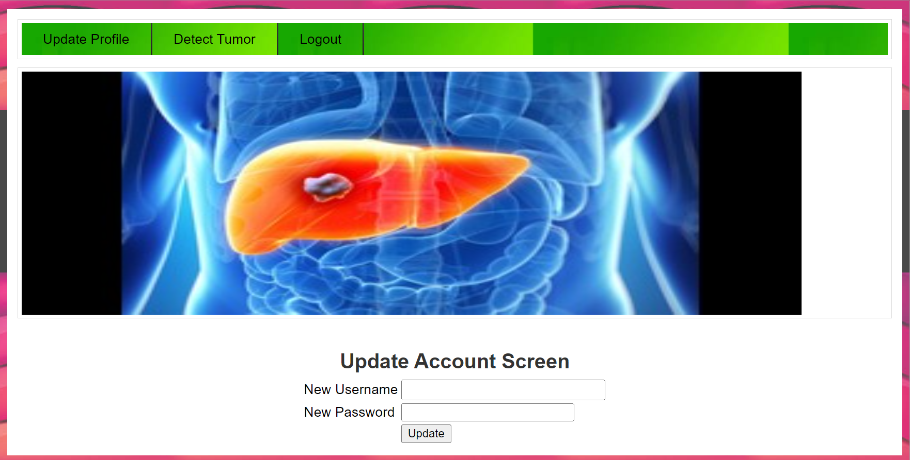

# Liver Tumor Detection Using Deep Learning

This repository contains the source code and documentation for the Liver Tumor Detection project, which was developed as a part of the final year Bachelor of Technology in Computer Science and Engineering (BTech CSE) capstone project.

### Project Overview

The Liver Tumor Detection project aims to develop a user-friendly web application utilizing Deep Learning techniques for the detection and detection of liver tumors in medical images. The key features of the project include:

- **User-Friendly Web Application**: Designed and developed a web application using Python and the Django web framework. This application allows users to conveniently upload medical images for analysis.

- **Tumor Detection and Analysis**: The application employs Deep Learning algorithms to determine the presence or absence of liver tumors in the uploaded images. It also identifies the stage of tumors, locates them within the image, and provides users with a percentage representation of affected area.

- **Visualization**: The application visualizes the detected tumors separately, facilitating user-friendly interpretation of the results.

### Tech Stack

The project utilizes the following technologies:

- **Python**: Programming language used for backend development and implementing Deep Learning algorithms.
- **Django**: Web framework for building the user interface and handling user interactions.
- **MySQL Database**: Database management system for storing and managing the information about the users credentials.

### Versions
- Python   : 3.7.0
- MySql    : 5.5
- Editor   : Jupiter notebook (recommended) or VisualStudio   
- other libraries versions are there. Use that only otherwise errors might come in your local system.

### Note
- I have uploaded files of required requirements ( python version and mysql version) or <a href="https://drive.google.com/drive/folders/1xNZrCv-brEJmQ0ELoge_Q_57qGuJqEu4" target="_blank"><strong> Google Drive Link </strong></a>
- I have included all python files as LiverTumorDetection Zip file. Extract the files in your PC.
- Use same versions for libraries to or else you may face errors while running the program.

### Dataset Information:
- We have used around 755 images for this project. ( images and mask images also for noising).

### Running Program Instructions
- Once, all files are installed in your PC. Open the run.bat file (**must**)
- Then paste the link in your browser. (**google**) [ http://127.0.0.1:8000/index.html ]
- If you want to see the Algorithm code, then open Views.py file to view the program.
- Login through the credentials (username: admin, password: admin)
- Then click on Detect tumor option at menu bar. Then give the name and upload the image from test_images folder. Click on Submit button
- You will get the output as i mentioned before in project overview.
- Attached project images for better understanding.

### Project Images

### Project Supervisor
- Dr. Senthil Kumar Janahan ( Associate Professor at Lovely Professional University )</b> [<a href ="https://www.linkedin.com/in/dr-senthil-kumar-janahan-511b5353/" target="_blank">LinkedIn</a>]

### Output Video
[)]

